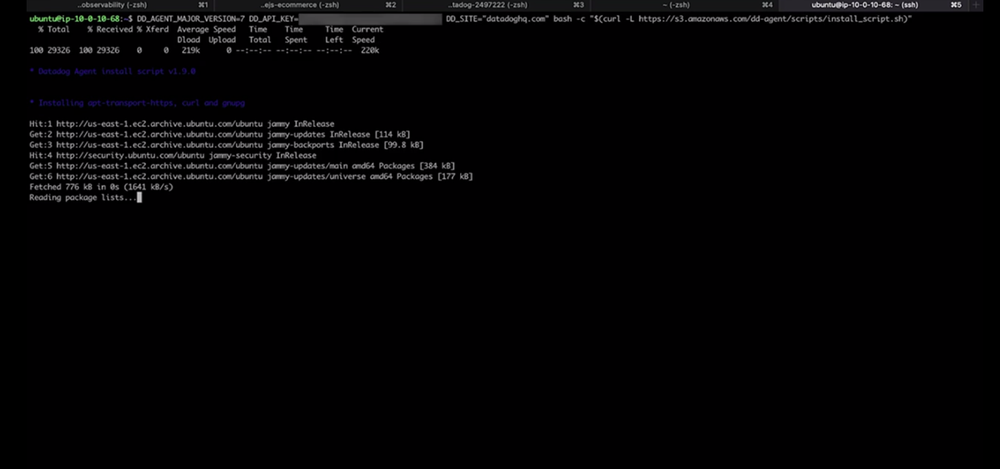

# Datadog
## All about datadogh

### Observability 
> give transparancy for all integration system service 

kind of observability 
- Metrics
> Data point tha can be aggregated and analyzed statistically which then give you a measurement of a system perfomance 
> example: Memory Usage, CPU Usage, Disk Latency

- Log
> Text Record output from either infrastructure or application 

- Traces
> Traces show lifecycle a request as pass through your service and infrastucture
> Traces show every point represent  every process 

Benefits Of Observability 
- Visibility into System Performance 
- Optimal Observability metrics
- Quantitative Data that drive system improvements

### Infrastructure Monitor
How integrations Datadog to cloud 

1. Menu Integration -> find aws -> choose aws -> click install
2. Create Access Keys

   
   
3. Add data on console aws, and create IAM role for datadogh account 

   

### Infrastucture Monitoring Features 
- Live Process
- Network Monitoring 
- Container Monitoring 
- Serverless Monitoring

### Datadogh Agent 
How Install Datadogh Agent 

1. Infrastructure Map -> click instance -> Choose Install Agent 

2. Choose Wich on OS your using https://docs.datadoghq.com/agent/
   ex: Ubuntu
   
3. Go to console instance server ex: ec2 

   

5. Use systemctl status datadog-agent
   - status
   - restart
   - start
   - stop
   - 
4. config datadog 
   - vi /etc/datadog-agent/datadog.yaml

5. for setup you can refer to https://docs.datadoghq.com/agent/

### Datadogh APM 
> Application Performance Monitoring 
> Give ability measure an applications: performance, reliability, availability

- Errors: Rate Failed Request
- Latency: time it take to response to request
- Throughput: number request by service
- Saturation: utilization an infrastructure resources

How Using APM  https://docs.datadoghq.com/tracing/

1. Menu Integrations -> choose tab Agent -> choose defending your OS using
2. After install agent 
3. Menu APM -> setup & configuration  -> instrument a new service -> Host Based -> Choose Language your using -> following instruction *should be install dd-trace 
4. on your service code, you need initial tracer pointing want tracing
5. after all setup you can check on Menu Apm -> tab services 

### Define SLI, SLO, error budget with datadog

1. Service Level Indicator (SLIs)
> key metric measure system performance and affect user experience
2. Service Level Objectives (SLOs)
> The Availability Target for service ex: 999.999

### Factors Affecting SLO levels
- Third-party dependecies 
- Cost
- User Impact 

refer to this link for calculate availability : https://availability.sre.xyz/

How datadog set SLOs
1. Menu APM -> tab SLOs -> click new SLOs

   

2. set metric 

   

3. set target 

   

4. you can set alert error budget alert

### Enabling Log
1. Menu Logs -> Get Started -> Server -> Choose Language -> following setup 
2. Setting file log application to config datadogh
Result like

   

git remote add notes-datadogh git@github.com:rifkytech86/note-datadogh.git